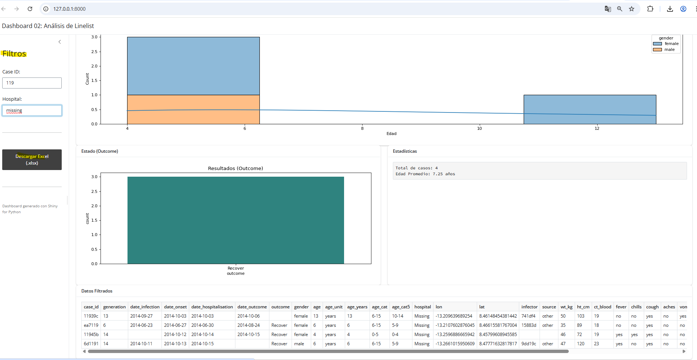
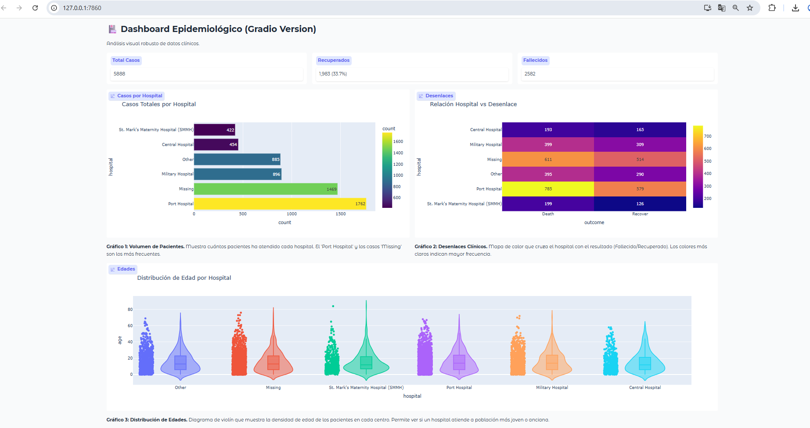
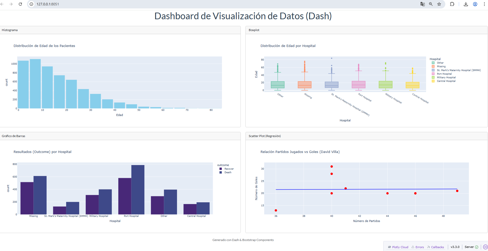

# 🎓 Práctica con R y Python: Epidemiología Básica

> **Realizado por:** [Daniel Alexis Mendoza Corne](https://github.com/alxz0212) 👨‍💻

¡Bienvenidos al proyecto! 👋

Este repositorio contiene una serie de scripts y dashboards diseñados para practicar análisis de datos en el contexto de la epidemiología. Aquí encontrarás ejemplos de limpieza de datos, análisis estadístico y visualización interactiva utilizando diversas tecnologías de Python (y referencias a R).

El objetivo es que aprendas a procesar un "linelist" (lista de casos) de pacientes, limpiarlo, analizarlo y presentarlo en dashboards profesionales.

## 🚀 ¿Por dónde empezar?

El proyecto sigue una estructura numérica para guiarte paso a paso. A continuación te explicamos cada archivo importante:

### 1. Limpieza y Preparación de Datos 🧹

Antes de visualizar, necesitamos datos limpios.

- **`02_limpieza_y_preparacion.py`**: Este script toma los datos crudos, estandariza columnas, maneja valores nulos y exporta un archivo limpio (`linelist_cleaned.xlsx` o `linelist_limpio_resuelto.csv`) listo para usar.
- **`02.1_Resolucion.py`**: Una versión alternativa o resuelta del proceso de limpieza, con técnicas adicionales.

### 2. Tablas y Análisis Descriptivo 📊

- **`03_tablas_y_analisis_descriptivo.py`**: Aquí aprendemos a generar tablas de frecuencias y estadísticas básicas para entender la demografía de los pacientes.
- **`03.1_Resolucion.py`**: Soluciones a ejercicios de análisis planteados.

### 3. Visualización de Datos (Estática) 📈

- **`04_visualizacion_datos.py`**: Generación de gráficos estáticos utilizando bibliotecas estándar de ciencia de datos.
  - 🛠️ _Librerías_: `matplotlib`, `seaborn`, `pandas`.

### 4. Dashboards Interactivos 🖥️

Hemos creado **cuatro** versiones de dashboards interactivos para que compares diferentes frameworks de Python. ¡Elige tu favorito!

#### 🔹 01.1_Dashboard.py (Streamlit)

_Tecnología_: **Streamlit**
_Características_: Es la forma más rápida de convertir scripts de datos en apps web. Ideal para prototipado rápido y tutoriales interactivos.
_Qué hace_: Muestra filtros laterales, gráficos básicos y conceptos matemáticos interactivos.


- 🛠️ _Librerías_: `streamlit`, `pandas`, `numpy`, `scipy`.

#### 🔹 02.2_Dashboard.py (Shiny for Python)

_Tecnología_: **Shiny**
_Características_: Framework traído del ecosistema R. Excelente para reactividad compleja y aplicaciones tipo "enterprise" que requieren un control fino del estado.
_Qué hace_: Un dashboard robusto con filtros reactivos para Case ID y Hospital, y descarga de datos.



- 🛠️ _Librerías_: `shiny`, `pandas`, `seaborn`, `matplotlib`.

#### 🔹 03.5_Gradio_Dashboard.py (Gradio)

_Tecnología_: **Gradio**
_Características_: Originalmente diseñado para demos de Machine Learning, es excelente para interfaces limpias y fáciles de compartir.
_Qué hace_: Dashboard epidemiológico con KPIs numéricos y gráficos explicativos.



- 🛠️ _Librerías_: `gradio`, `pandas`, `plotly`.

#### 🔹 04.1_Dashboard.py (Dash & Plotly)

_Tecnología_: **Dash**
_Características_: El estándar en la industria para visualización analítica avanzada. Totalmente personalizable y basado en React (aunque escribes solo Python).
_Qué hace_: Visualizaciones interactivas de histogramas, boxplots, mapas de calor y gráficos de barras utilizando `Plotly` para una experiencia de usuario rica.



- 🛠️ _Librerías_: `dash`, `dash-bootstrap-components`, `plotly`, `pandas`.

---

## 🛠️ Cómo ejecutar el proyecto

Para tu comodidad, hemos creado un "lanzador" maestro para algunos servicios, pero recomendamos ejecutar cada uno individualmente para ver su comportamiento específico.

### Ejecutar dashboards individuales

**Streamlit:**

**Streamlit:**

```bash
py -m streamlit run 01.1_Dashboard.py
```

**Shiny:**

```bash
py -m shiny run 02_2_Dashboard.py
```

**Gradio:**

```bash
py 03.5_Gradio_Dashboard.py
```

**Dash:**

```bash
py 04.1_Dashboard.py
```

---

## 📚 Requisitos

Asegúrate de tener instaladas las librerías necesarias ejecutando:

```bash
pip install -r requirements.txt
```

¡Disfruta aprendiendo y analizando datos! 🦠🔍

---

## 🏗️ 4 Fundamentos Clave del Proyecto

En este proyecto hemos aplicado cuatro pilares fundamentales de la ciencia de datos aplicada a la epidemiología:

1.  **Limpieza de Datos (Data Cleaning)**: Transformación de datos crudos (`raw list`) a formatos estructurados, manejo de nulos y estandarización.
2.  **Análisis Descriptivo (EDA)**: Uso de tablas de frecuencia y estadística descriptiva para entender la distribución demográfica y clínica.
3.  **Visualización Epidemiológica**: Creación de gráficos significativos (curvas epidémicas, pirámides poblacionales) para comunicar hallazgos.
4.  **Desarrollo de Herramientas Interactivas (Web Apps)**: Implementación de dashboards para democratizar el acceso a la información y facilitar la toma de decisiones en tiempo real.

---

## 📜 Créditos y Referencias

Este proyecto ha sido desarrollado siguiendo la metodología y el código base de **Juan Marcelo Gutierrez Miranda (@TodoEconometria)**.

- **Autor original**: Juan Marcelo Gutierrez Miranda
- **Institución**: @TodoEconometria
- **Hash de Certificación**: `4e8d9b1a5f6e7c3d2b1a0f9e8d7c6b5a4f3e2d1c0b9a8f7e6d5c4b3a2f1e0d9c`

Para profundizar más en los temas tratados, recomendamos las siguientes referencias "Standard":

1.  **Batra, N., et al. (2021).** _The Epidemiologist R Handbook_. (Una referencia esencial para epidemiología de campo).
2.  **Wickham, H. & Grolemund, G. (2017).** _R for Data Science_. O'Reilly Media. (Referencia fundamental para ciencia de datos comparada).

> **🤖 Asistencia Técnica**: Este proyecto contó con la colaboración de **Gemini 3 Pro** (Google DeepMind) para la generación de código, depuración y estructuración didáctica.

### 🎓 Agradecimientos

Todo este trabajo ha sido posible gracias a lo aprendido en el curso **IFCD105 Especialista en Big Data** impartido en [Cursos Gratuitos Madrid](https://cursosgratuitosmadrid.com/).

---

## 👨‍💻 Realizado por

**Daniel Alexis Mendoza Corne**
_Ingeniero Informático y de sistemas_
[GitHub Profile](https://github.com/alxz0212)
